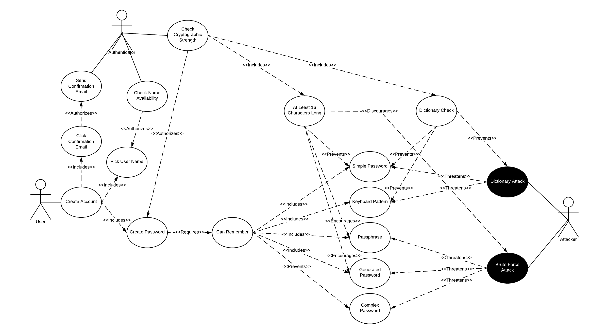
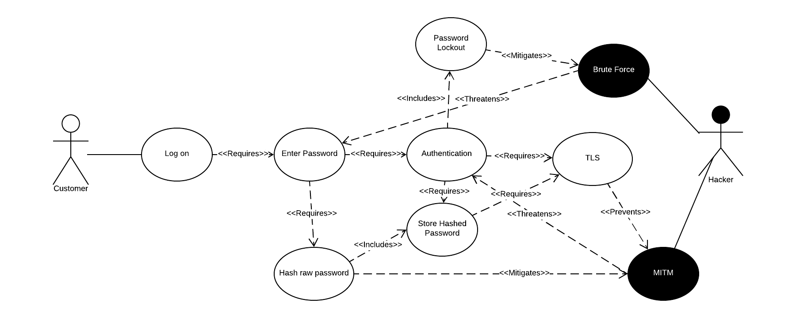
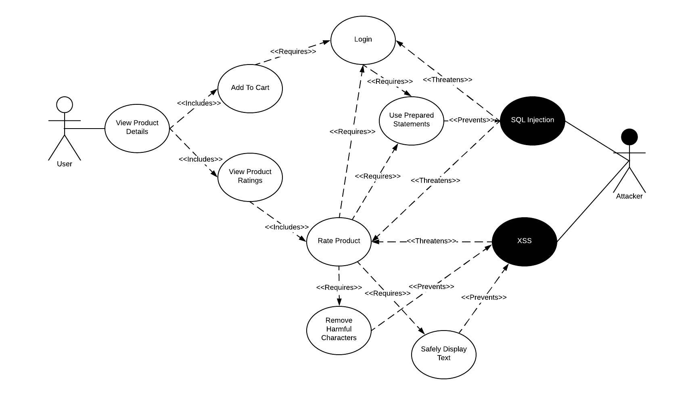
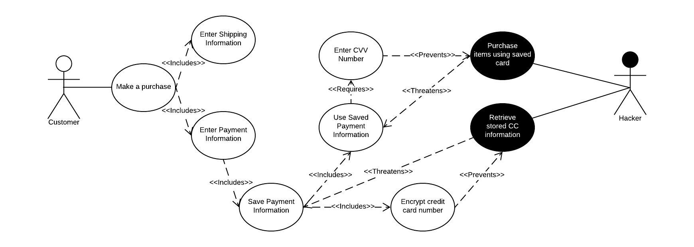
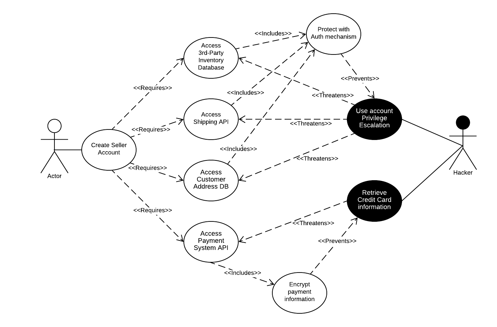

# Requirements for Software Security Engineering

## Use Cases and Misuse Cases

All LucidChart diagrams are available at https://app.lucidchart.com/invitations/accept/2c9fcfe6-8eb9-4e8a-8bd3-dc143cb7393c

### Case 1: Create an Account
User stories:
* As a customer, I want to create an account in the Spring Store so that I can use them for all my spring related needs.
* As a customer, I want to be able to use a password so I can log into my account later.

Derived security requirements:
* The system must be able to uniquely identify each account with a username and password.
** The system must enforce password complexity requirements.
* The system must provide the ability to encrypt data at rest and decrypt it when needed.
* The system must have a secure password checking mechanism.

### Case 2: Login to Account
User stories:
* As a customer, I want to return to my account in the Spring Store so that I can use them for all my spring related needs.
* As a customer, I want to be able to reuse a password so I can log into my account again.

Derived security requirements:
* The system must be able to uniquely identify each account with a username and password.
* The system must provide the ability to encrypt data at rest and decrypt it when needed.
* The system must have a secure password checking mechanism.

### Case 3: Browse Inventory
User stories:
* As a customer, I want to search the Spring Store inventory so that I can use them for all my spring related needs.
* As a customer, I want to be able to add items to my shopping cart for immediate or later purchase.
* As a customer, I want to be able to view product ratings.
* As a customer, I want to be able to add product ratings.

Derived security requirements:
* The system must provide the ability to encrypt data at rest and decrypt it when needed.
* The system must have a secure text entry checking mechanism.
** The system must have protection against SQL injection
** The system must have protection against cross site scripting attacks

### Case 4: Make a purchase
User stories:
* As a customer, I want to purchase springs through Spring Store so that I can use them for all my spring related needs.
* As a customer, I want to be able to save my payment and shipping information for the next time I check out so that I can purchase springs more quickly in the future.

Derived security requirements:
* The system must provide the ability to encrypt data at rest and decrypt it when needed.
* The system must have a secure password checking mechanism.

### Case 5: Manage a Vender Account
User stories:
* As a vender, I want to access the Spring Store payment system API so that I can use them to sell my spring-related products.
* As a vender, I want to access the Spring Store customer address DB so that I can use them to sell my spring-related products.
* As a vender, I want to access the Spring Store shipping API so that I can use them to sell my spring-related products.
* As a vender, I want to access the Spring Store 3rd-Party inventory DB so that I can use them to sell my spring-related products.

Derived security requirements:
* The system must provide the ability to encrypt data at rest and decrypt it when needed.
* The system must provide account authorization protection. 
* The system must have a secure password checking mechanism.

## Alignment of Security Requirements with Spring Security
In the use cases above, we derived five security requirements, several of which are shared between use cases. These align with the functionality provided by Spring Security as follows:
* **The system must be able to uniquely identify each account with a username and password.** This functionality is provided by Spring Security's `UserDetailsService`. This service can be implemented in a variety of ways, such as in memory, file backed, or database backed, depending on the user's implementation needs. For the Spring Store we would most likely find the database backed implementation to be the most appropriate.
* **The system must provide the ability to encrypt data at rest and decrypt it when needed.** This functionality can be found in Spring Security's `Encryptors` module, which provides for AES-256 encryption using a PBKDF2 (Password Based Key Derivation Function) generated key. Because it requires secure storage of a password, this implementation is not as secure as a hardware security module or 3rd party service such as [Amazon's KMS](https://aws.amazon.com/kms/), but could make sense for storing values in a database given the existence of the `Encryptors.queryableText` method. This method uses a fixed IV and therefore allows for improved searching functionality against stored data. 
* **The system must have a secure text entry checking mechanism.** Spring Security does not provide text sanitization functionality, though this can be easily added through other libraries such as the [OWASP HTML sanitizer](https://github.com/OWASP/java-html-sanitizer). Additionally, web pages rendered through JSPs produced by Spring Web will default to securely rendering any values passed to them, which provides protection against stored XSS attacks.
** **The system must have protection against SQL injection.** Spring Security does not provide protection against SQL injection attacks, though this functionality is integrated with Spring Data to some extent through the use of parameterized queries and ORM frameworks such as JPA/Hibernate.
** **The system must have protection against cross site scripting attacks.** Spring Security does provide some protection against XSS attacks by configuring the `HttpSecurity` module with the `.headers().xssProtection()` flag, which will add `X-XSS-Protection` to our HTTP headers. This and various other protection mechanisms are enabled by default by adding Spring Security to one's project, which is an excellent use of the Secure Defaults security pattern.
* **The system must have a secure password checking mechanism.** Spring Security provides a `PasswordEncoder` module which provides two methods - `encode` and `matches`. This password encoder can be backed one of several different hashing algorithms, such as BCrypt (blowfish) or PBKDF2. Once the password is initially encoded, it would be stored with a value such as `$2a$10$N9qo8uLOickgx2ZMRZoMyeIjZAgcfl7p92ldGxad68LJZdL17lhWy` that should be difficult for an attacker to brute force. Password validation would be conducted using the `matches` method, which takes in a plaintext password and the hashed value, and returns true or false. For the above hash, `matches("password", "$2a$10$N9qo8uLOickgx2ZMRZoMyeIjZAgcfl7p92ldGxad68LJZdL17lhWy")` might return `false`, while `matches("CorrectHorseBatteryStaple", ...)` might return `true`, but an attacker would have no easy way of knowing this without trying every possible string.
** **The system must enforce password complexity requirements.** Spring Security does not provide a mechanism for enforcing password complexity requirements. The reason for this is likely that there is no broadly accepted standard for this, and many systems like to have their own approach to it. A typical best practice is to implement complexity validation in both the frontend and backend of a system, so that real time feedback can be provided to a user as they type their password, and so that a POST/PUT request can't be made to bypass this validation and create a user with an insecure password.
* **The system must provide account authorization protection.** This functionality is provided by Spring Security's filter chain in conjunction with various configuration options. This can include the `HttpSecurity` class in conjunction with `antMatcher` statements to implement something such as allowing all requests to `/api/login/**`, requiring a specific role for `/admin/**`, and redirecting other requests to a form-based login page. Authorization protection can also be implemented using the `@PreAuthorize` and `@PostAuthorize` methods, which check a principal's roles before and after calling a method, respectively. A method could be marked with something like `@PreAuthorize(hasRole("ROLE_SELLER"))` to restrict access to only users with a `SELLER` role in the system. This authorization can be made very granular and customized depending on specific use cases and where in the whole set of calls we want to stop a user's activity.

## Spring Security Documentation Review

Spring Security, and the Spring Framework as a whole, tends to have very good documentation, and has put a lot of work into making installation simple through the use of Maven and Gradle. Within the project itself, the documentation consists of a manual containing guides on various topics such as [Security HTTP Response Headers](https://github.com/spring-projects/spring-security/blob/master/docs/manual/src/docs/asciidoc/_includes/reactive/exploits/headers.adoc), and various sample applications designed to show users how to implement use cases such as [OAUTH2 authorization](https://github.com/spring-projects/spring-security/tree/master/samples/boot/oauth2authorizationserver). Outside the project, the Spring Security Team provides a great deal of documentation on all aspects of the project which can be found in the [Spring Security Reference](https://docs.spring.io/spring-security/site/docs/current/reference/html5/). The Spring Security Reference documentation is not open source and editable by anyone, but the documentation in the github repository can receive contributions.

In reviewing the documentation, we noticed that the examples have inconsistent `readme.md` files. For example, the [OAUTH 2 sample](https://github.com/spring-projects/spring-security/tree/master/samples/boot/oauth2authorizationserver) has a file `README.adoc` which is displayed when viewing the folder and contains basic information about what the sample is meant to demonstrate, how to run it, and a sample request and response showing the OAUTH token response. Other samples, such as [hellorsocket](https://github.com/spring-projects/spring-security/tree/master/samples/boot/hellorsocket) contain no documentation to indicate what they are meant to show. While the gradle build file and name indicate that this is demonstrating RSocket, there is little to say what it is, how it works, what we expect to see from RSocket's interactions with Spring Security, or anything of the sort. A user building an application with RSocket and Spring Security who found this example would be highly disappointed. 

A second major observation is that the documentation is somewhat confusingly organized within the project. There are folders for docs and samples, but there is no nicely presented index telling a user what to expect within these folders, where to find things, how to contribute, etc. The examples and documentation are being actively updated, but aren't even mentioned in the repository's base-level `README.adoc` file, which instead directs users to the [Spring Security Reference](https://docs.spring.io/spring-security/site/docs/current/reference/html5/). It's not bad to have multiple sources of documentation, but it is bad if people are contributing to documentation that has no visibility or organization as it is likely going unused in many cases. This could be a valuable area to make some contributions, as knowledge management and organization can be difficult and are typically an afterthought for most organizations and projects.

## Project Board
Our project board and team assignments for this assignment can be found at 
https://github.com/Vidmaster/cybr8420-group4/projects/1?card_filter_query=label%3Arequirements. The tickets which are not assigned were a collaboration between several team members.

## Teamwork Reflection

Our team struggled at the start of this assignment due to everyone having a slightly different understanding of the scope and focus of the use cases. Bryan was heavily focused on very technical details, and Henry was thinking at too high a level. The team worked together well, and Andrew stepped up and demonstrated that he is a LucidChart wizard, turning everyone's thoughts into excellent use case diagrams. We had some challenges around determining how to break the work down, which is demonstrated through our project board. The initial approach of saying each person works on one use case end to end turned out to not be a great idea in practice, as it led to overlapping use cases, different looking diagrams, and varying levels of detail. Henry also found it would be more beneficial to leverage his expertise with the Spring Framework for discussing things like their alignment with our security requirements and their documentation than to spend his time on the use cases. Overall we struggled a little bit on our coordination for this assignment, but hopefully these lessons will serve us well on subsequent assignments.
